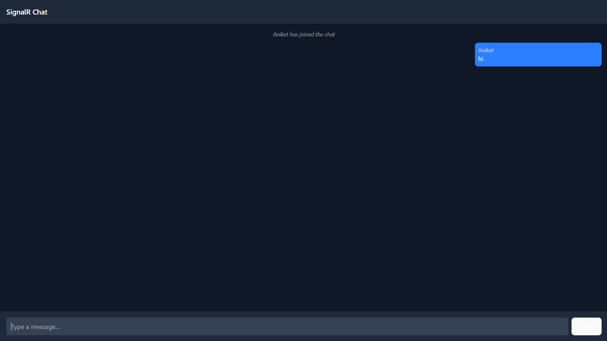
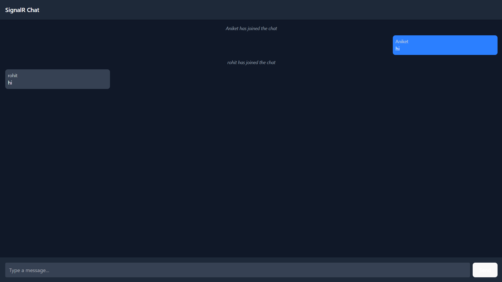

# 💬 Talkivo

**A real-time chat application built with React, TypeScript, ASP.NET Core, and SignalR.**

Talkivo is a modern real-time messaging platform that lets users chat instantly, with live message delivery powered by SignalR. The project is split into a **React + TypeScript + Vite frontend** and an **ASP.NET Core 9 + SignalR backend**.

---

## 🔗 Project Links

| Resource | Link |
|---|---|
| Frontend Repo | [Talkivo-Frontend](https://github.com/aniketagvane3232/Talkivo-Frontend) |
| Backend Repo | [Talkivo-Backend](https://github.com/aniketagvane3232/Talkivo-Backend) |
| Live App | [talkivo-frontend.vercel.app](https://talkivo-frontend.vercel.app/) |

---

## ✨ Features

- 💬 **Real-Time Messaging** — instant message delivery powered by SignalR
- 🔐 **Authentication** — secure sign up and login
- 🟢 **Live Presence** — see who's online in real time
- 📱 **Responsive UI** — works across desktop, tablet, and mobile
- ⚡ **Fast & Type-Safe** — built with TypeScript and Vite for speed and reliability
- 🔄 **Frontend/Backend Integration** — React frontend communicates with the ASP.NET Core API and SignalR hub

---

## 🛠️ Tech Stack

**Frontend**
- React
- TypeScript
- Vite
- SignalR Client
- CSS

**Backend**
- ASP.NET Core 9
- C# / .NET
- SignalR
- REST APIs

---

## 🏗️ Architecture

```
                    ┌──────────────────────┐
                    │         USER          │
                    └──────────┬────────────┘
                               │
                               ▼
                    ┌──────────────────────┐
                    │  React + TypeScript   │
                    │   Frontend (Vite)     │
                    └──────────┬────────────┘
                               │
                   REST API  │  SignalR (WebSockets)
                               │
                               ▼
                    ┌──────────────────────┐
                    │   ASP.NET Core 9      │
                    │   Backend + SignalR   │
                    │        Hub            │
                    └──────────┬────────────┘
                               │
                               ▼
                        ┌───────────┐
                        │  Storage  │
                        └───────────┘
```

### Main Components

| Component | Responsibility |
|---|---|
| React + TypeScript | User interface and client-side application |
| Vite | Build tool and dev server |
| SignalR Client | Real-time bidirectional communication with the backend |
| ASP.NET Core API | Business logic and REST endpoints |
| SignalR Hub | Broadcasts and manages real-time chat messages/events |

---

## 📸 Screenshots

<p align="center">
  
  <br><em>💬 Chat Interface</em>
</p>

<p align="center">
  
  <br><em>🟢 Live Messaging</em>
</p>

<p align="center">
  
  <br><em>📱 Responsive View</em>
</p>

---

## 🚀 Getting Started

### Prerequisites

- Node.js and npm
- .NET SDK
- Git

### 1. Clone the Frontend

```bash
git clone https://github.com/aniketagvane3232/Talkivo-Frontend.git
cd Talkivo-Frontend
```

### 2. Install Frontend Dependencies

```bash
npm install
```

### 3. Configure the Frontend

Create/update your `.env` file with the backend API and SignalR hub URL:

```env
VITE_API_URL=http://localhost:5000
VITE_SIGNALR_HUB_URL=http://localhost:5000/chathub
```

### 4. Start the Frontend

```bash
npm run dev
```

Open the local Vite URL shown in your terminal (usually `http://localhost:5173`).

---

## ⚙️ Backend Setup

The backend is maintained in a separate repository: [Talkivo-Backend](https://github.com/aniketagvane3232/Talkivo-Backend)

```bash
git clone https://github.com/aniketagvane3232/Talkivo-Backend.git
cd Talkivo-Backend/Backend.Chat
dotnet restore
dotnet run
```

Configure any required application settings in `appsettings.json` before running.

> ⚠️ **Important:** Never commit real connection strings, JWT secrets, or API keys to GitHub. Use environment variables or a local `appsettings.Development.json` (excluded via `.gitignore`) instead.

For full backend configuration and SignalR hub implementation details, see the [backend repository](https://github.com/aniketagvane3232/Talkivo-Backend).

---

## 🔌 Real-Time Message Flow

```
User A                          User B
  │                                │
  ▼                                ▼
React Client A               React Client B
  │                                │
  └──────────► SignalR Hub ◄───────┘
              (ASP.NET Core)
                    │
                    ▼
              Broadcast to
             connected clients
```

---

## 📁 Project Structure

**Frontend**

```
Talkivo-Frontend/
├── assets/
│   ├── chat1.png
│   ├── chat2.png
│   └── chat3.png
├── public/
├── src/
├── package.json
├── vite.config.ts
├── tsconfig.json
└── README.md
```

**Backend**

```
Talkivo-Backend/
├── Backend.Chat/
│   ├── Controllers/
│   ├── Hubs/
│   ├── Models/
│   ├── Program.cs
│   └── appsettings.json
├── assets/
├── Backend.Chat.sln
└── README.md
```

> Both structures may evolve as the project grows.

---

## 🌐 Deployment

- **Frontend:** deployed on [Vercel](https://talkivo-frontend.vercel.app/)
- **Backend:** maintained separately and deployable independently — see [Talkivo-Backend](https://github.com/aniketagvane3232/Talkivo-Backend)

---

## 🎯 Project Goals

Talkivo was built to explore real-time communication patterns using SignalR — delivering instant, low-latency messaging between users with a clean, type-safe frontend and a lightweight ASP.NET Core backend.

---

## 🤝 Contributing

Contributions and suggestions are welcome!

```bash
# Fork the repository
# Create a feature branch
git checkout -b feature/my-feature

# Make your changes
git add .
git commit -m "Add my feature"

# Push your branch
git push origin feature/my-feature
```

Then open a Pull Request on GitHub.

---

## 👨‍💻 Author

**Aniket Agvane**

- GitHub: [@aniketagvane3232](https://github.com/aniketagvane3232)
- Frontend: [Talkivo-Frontend](https://github.com/aniketagvane3232/Talkivo-Frontend)
- Backend: [Talkivo-Backend](https://github.com/aniketagvane3232/Talkivo-Backend)

---

## ⭐ Support

If you find Talkivo useful, consider giving the repositories a ⭐ on GitHub — it helps a lot!

<p align="center"><strong>Talkivo — Chat. Connect. In Real Time.</strong></p>
